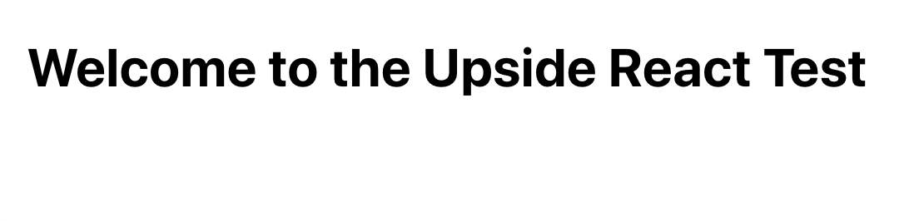

# Upside React Test

Welcome to Upside React Test and thank you for taking part.

Please **fork** then checkout this repo and make sure this skeleton react project is running before the interview.

Then on the day if you could have your favourite IDE open with this running ready for screen share that would be great.

We'll ask you to implement a small feature which should take about an hour. During that hour the goal is to get something working. Also it'd be nice to talk us through your approach and be asking questions.

Thank you.

## Starting the project.

Much like any create react app project, you need to do the following.

```
yarn install
yarn start
```

Then your web browser should open on `http://localhost:3000/` and you're ready to start coding with hot reload enabled.

You should see the following screen:



